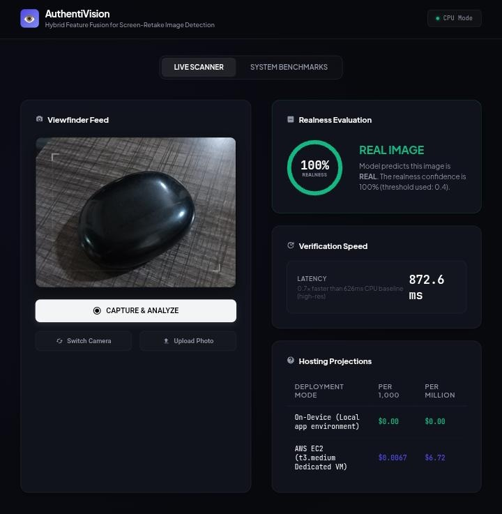
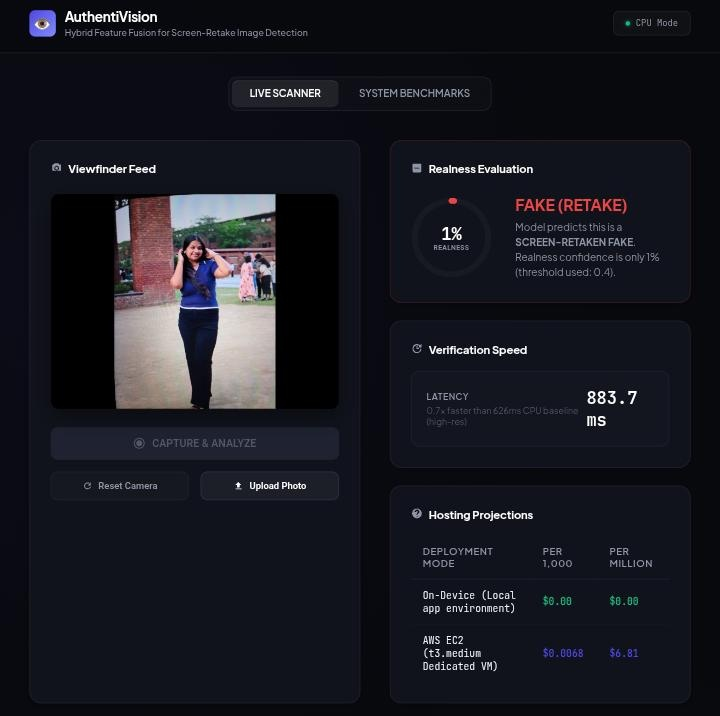
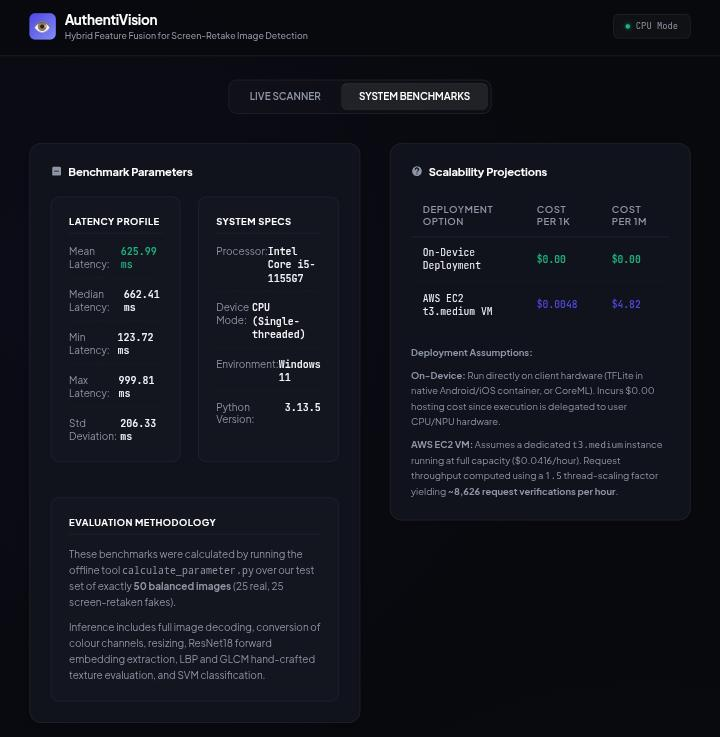

<h1 align="center">👁️ AuthentiVision</h1>

<p align="center">
<b>Hybrid Feature Fusion for Screen-Retake Image Detection</b>
</p>

<p align="center">
<i>Detect • Verify • Protect</i>
</p>


------------------------------------------------------------------------


# 🚀 Live Demo

🔗 https://fakeimageproject.onrender.com

------------------------------------------------------------------------

# • Overview

**AuthentiVision** is a hybrid AI framework for detecting
**Screen-Retake (Presentation Attack)** images.

Unlike conventional image classifiers that rely only on deep learning,
AuthentiVision combines:

-  Deep CNN Features (ResNet18)
-  Handcrafted Texture Features
-  Support Vector Machine (SVM)

This hybrid architecture enables the system to detect subtle spoofing
artifacts such as:

-   Moiré patterns
-   Screen pixel grids
-   Display glare
-   Artificial sharpness
-   Frequency-domain inconsistencies

making it suitable for **KYC**, **Identity Verification**, **Face
Authentication**, and **Presentation Attack Detection**.

------------------------------------------------------------------------

# • Motivation

Presentation attacks are one of the major security threats in digital
identity verification.

Instead of presenting a real face, an attacker may simply show a photo
displayed on a phone, laptop, tablet, or monitor.

While humans can often recognize screen artifacts, conventional CNNs
tend to focus on semantic information rather than fine-grained texture.

AuthentiVision addresses this limitation through Hybrid Feature
Fusion, combining deep semantic understanding with handcrafted optical
descriptors.

------------------------------------------------------------------------

# • Hybrid Pipeline

``` text
                  Input Image
                       │
        ┌──────────────┴──────────────┐
        │                             │
        ▼                             ▼

     ResNet18 CNN            Texture Extraction

 512-D Deep Embedding      FFT
                           LBP
                           GLCM
                           Laplacian
                           Sobel
                           Entropy
                           Color Statistics

        │                             │
        └──────────────┬──────────────┘
                       ▼

              532-D Feature Vector

                       │

                Standard Scaler

                       │

                 SVM Classifier

                       │

               ✅ Real / ❌ Fake
```

------------------------------------------------------------------------

# • Features

-    Live Webcam Scanner
-    Image Upload
-    Front / Back Camera Switching
-    Client-side Image Compression
-    Optimized CPU Inference
-    Cloud-Friendly Deployment
-    Latency Benchmark Dashboard
-    Cost Estimation
-    Responsive Dark UI

------------------------------------------------------------------------

# • Feature Engineering

##  Deep Learning

-   Fine-tuned ResNet18
-   Identity head removed
-   512-dimensional embeddings

##  Handcrafted Features

### Frequency Analysis

-   FFT

### Texture Descriptors

-   Local Binary Patterns (LBP)
-   Gray-Level Co-occurrence Matrix (GLCM)

### Edge Features

-   Laplacian Variance
-   Sobel Gradients

### Statistical Features

-   Entropy
-   RGB Mean
-   Variance

------------------------------------------------------------------------

# • Dataset

To prevent train-test leakage:

-  dHash similarity checking
-  Group-stratified splitting

| Dataset Split | Real Images | Fake Images | Total |
|---------------|------------:|------------:|------:|
| Train         | 40          | 40          | 80    |
| Validation    | 10          | 10          | 20    |
| Test          | 25          | 25          | 50    |

------------------------------------------------------------------------

# • Performance

| Metric | Value |
|--------|------:|
| Mean Latency | **625.99 ms** |
| Median Latency | **662.41 ms** |
| Minimum Latency | **123.72 ms** |
| Maximum Latency | **999.81 ms** |
| Classification Threshold | **0.40** |

------------------------------------------------------------------------

# • Deployment Cost

| Deployment Platform | Estimated Cost |
|---------------------|---------------:|
| On-Device Inference | **$0.00** |
| AWS EC2 (1,000 Images) | **$0.0048** |
| AWS EC2 (1,000,000 Images) | **$4.82** |

------------------------------------------------------------------------

# • Web Dashboard

### Live Scanner

-   Live webcam detection
-   Real-time prediction
-   Confidence score
-   Latency measurement
-   Cost estimator

### System Benchmarks

-   Hardware specifications
-   Latency statistics
-   Cost projections
-   Evaluation methodology

------------------------------------------------------------------------

# • Project Structure

``` text
AuthentiVision/
│
├── models/
├── iamges/
├── templates/
├── train/
├── test/
│
├── app.py
├── cnn_train.py
├── train_classifier.py
├── predict.py
├── evaluate.py
├── extract_embeddings.py
├── features.py
├── data_prep.py
├── calculate_parameter.py
├── interpretability.py
├── run_pipeline.py
├── requirements.txt
└── README.md
```

------------------------------------------------------------------------

# • Installation

``` bash
git clone https://github.com/Saumya1517/FakeImageProject.git

cd FakeImageProject

pip install -r requirements.txt

python app.py
```

------------------------------------------------------------------------


<h1> • Project Demo</h1>

<p align="center">


</p>

<p align="center">

</p>

<p align="center">
<b>Left:</b> Real image detection &nbsp;&nbsp;&nbsp;|&nbsp;&nbsp;&nbsp;
<b>Right:</b> Screen-retake detection &nbsp;&nbsp;&nbsp;|&nbsp;&nbsp;&nbsp;
<b>Bottom:</b> System benchmark dashboard
</p>

------------------------------------------------------------------------

# • Tech Stack

-   Python
-   PyTorch
-   OpenCV
-   Scikit-Learn
-   NumPy
-   Flask
-   HTML
-   CSS
-   JavaScript

------------------------------------------------------------------------

# • Future Improvements

-   MobileNetV3 deployment
-   Quantization
-   TensorRT optimization
-   Larger multi-device dataset
-   Video-based spoof detection
-   Multi-class presentation attack detection

------------------------------------------------------------------------


### ⭐ If you found this project useful, please consider giving it a Star!

